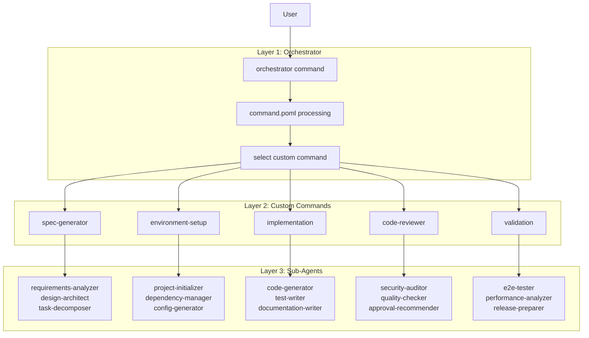
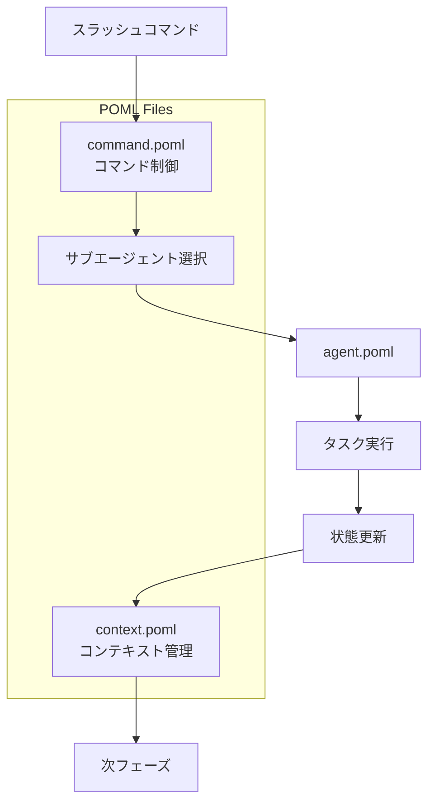
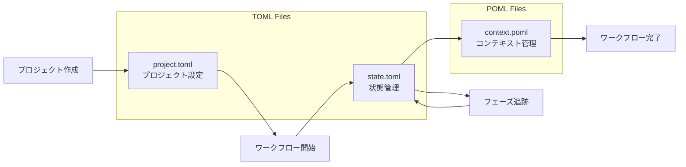

# CC-Deck v2 コアエンジン仕組み

## 概要

CC-Deck v2は、「時間のかかる開発ワークフローを単一コマンドに変える」AI-native開発プラットフォームです。

### 基本構成

CC-Deck v2のコアエンジンは、**5つのファイル**と**3層のコマンド体系**で構成されています：

**ファイル構成**：
- **POML** 3種類：command.poml（コマンド制御）、agent.poml（エージェント定義）、context.poml（コンテキスト管理）
- **TOML** 2種類：project.toml（プロジェクト設定）、state.toml（状態管理）

**3層コマンド体系**：
- **第1層 Orchestrator**：`/orchestrator [自然言語指示]` - 統合コマンド
- **第2層 カスタムスラッシュコマンド**：5つの専門コマンド（spec-generator、environment-setup、implementation、code-reviewer、validation）
- **第3層 サブエージェント**：各コマンドが呼び出す細分化されたタスク実行エージェント

### 設計思想

各ファイルが**単一責務**を持ち、**3層のコマンド体系**により段階的な制御が可能です。Orchestratorからカスタムスラッシュコマンドを呼び出し、さらにサブエージェントがタスクを実行する階層構造で、複雑な開発ワークフローを自動化します。

### 全体フロー



---

## POMLファイルの3つの役割

CC-Deck v2では、POMLファイルは役割に応じて**3種類**に分類されます：



### 1. command.poml - コマンド制御
- **役割**: スラッシュコマンドの解析・処理制御
- **機能**: 自然言語コマンドの解釈、適切なサブエージェント選択
- **例**: `/orchestrator create spec` の解析とルーティング

### 2. agent.poml - エージェント定義
- **役割**: サブエージェントの動作・挙動を制御
- **機能**: AIエージェントの personality、作業方針、出力形式の定義
- **例**: enterprise-agent.poml, rapid-prototyping-agent.poml

### 3. context.poml - コンテキスト管理
- **役割**: フェーズ間のコンテキスト情報の永続化・管理
- **機能**: 作業履歴、意思決定記録、次フェーズへの引き継ぎ情報、技術的制約
- **詳細**: 別ドキュメント「context.poml仕様書」で詳細化予定

## TOMLファイルの2つの役割

CC-Deck v2では、TOMLファイルを**2種類**使用します：



### 1. project.toml - プロジェクト設定
- **役割**: プロジェクト全体の設定・メタデータ管理
- **機能**: 技術スタック、作成日時、アクティブフィーチャー一覧
- **例**: 
```toml
project = "fintech-app"
tech_stack = ["Node.js", "React"]
features = ["user-auth", "payment"]

[metadata]
created_at = "2025-08-23T10:00:00Z"
version = "1.0.0"
description = "Enterprise fintech application"
```

### 2. state.toml - 状態管理
- **役割**: 各フィーチャーの実行状態・進捗管理
- **機能**: フェーズ追跡、承認状況、進捗パーセンテージ
- **例**:
```toml
[current]
phase = "implementation"
feature = "user-auth"

[approvals]
requirements = { approved = true, timestamp = "2025-08-23T09:30:00Z" }
design = { approved = true, timestamp = "2025-08-23T10:00:00Z" }
tasks = { approved = false }

[progress]
requirements = 100
design = 100
implementation = 45
```

## 3層コマンド体系

### 第1層: Orchestratorコマンド

Orchestratorは統一されたエントリーポイントとして、自然言語コマンドを解析し適切なカスタムスラッシュコマンドを選択します。

#### コマンド形式
```bash
/orchestrator [自然言語指示]
```

#### 読み込みファイル
- **command.poml** - コマンド解析ルール
- **project.toml** - プロジェクト設定
- **state.toml** - 現在の状態・フェーズ
- **context.poml** - 前回のコンテキスト情報

### 第2層: カスタムスラッシュコマンド

5つの専門カスタムスラッシュコマンドが、Orchestratorから呼び出されるか、直接実行されます。

#### 5つのカスタムスラッシュコマンド

##### 1. /spec-generator - 仕様生成
- **役割**: 要件分析、技術設計、タスク分解の統括
- **呼び出すサブエージェント**:
  - requirements-analyzer（要件分析）
  - design-architect（設計）
  - task-decomposer（タスク分解）

##### 2. /environment-setup - 開発環境構築
- **役割**: プロジェクト初期化と環境設定の統括
- **呼び出すサブエージェント**:
  - project-initializer（プロジェクト初期化）
  - dependency-manager（依存関係管理）
  - config-generator（設定ファイル生成）

##### 3. /implementation - 実装
- **役割**: コード実装とテスト作成の統括
- **呼び出すサブエージェント**:
  - code-generator（コード生成）
  - test-writer（テスト作成）
  - documentation-writer（ドキュメント作成）

##### 4. /code-reviewer - コードレビュー
- **役割**: コード品質とセキュリティ監査の統括
- **呼び出すサブエージェント**:
  - security-auditor（セキュリティ監査）
  - quality-checker（品質チェック）
  - approval-recommender（承認推奨）

##### 5. /validation - 検証
- **役割**: テストとリリース準備の統括
- **呼び出すサブエージェント**:
  - e2e-tester（E2Eテスト）
  - performance-analyzer（パフォーマンス分析）
  - release-preparer（リリース準備）

#### 読み込みファイル
- **command.poml** - コマンド制御（カスタムコマンド用）
- **project.toml** - プロジェクト設定
- **state.toml** - 現在状態
- **context.poml** - コンテキスト情報

#### 更新ファイル（カスタムコマンド完了時）
- **state.toml** - 実行結果と進捗を更新
- **context.poml** - 次のカスタムコマンド用コンテキスト情報を更新

### 第3層: サブエージェント

各カスタムスラッシュコマンドが呼び出す、細分化されたタスクを実行する専門エージェントです。サブエージェントは状態管理を意識せず、与えられたタスクの実行に集中します。

#### 読み込みファイル
- **agent.poml** - エージェント定義（挙動制御）
- タスク実行に必要な情報はカスタムコマンドから渡される

#### 更新ファイル
- なし（結果はカスタムコマンドに返却）