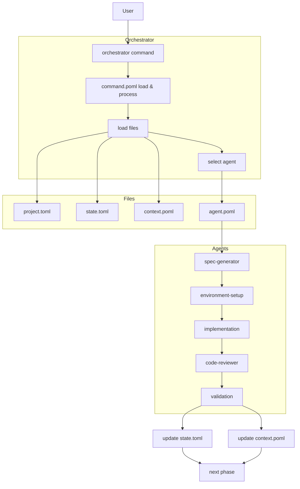
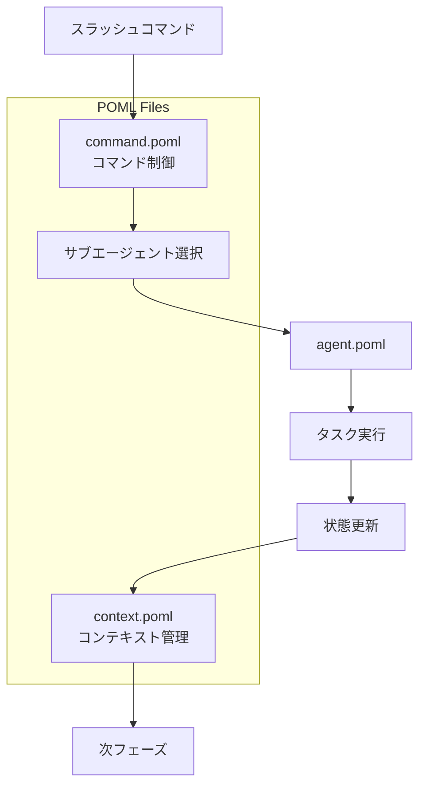
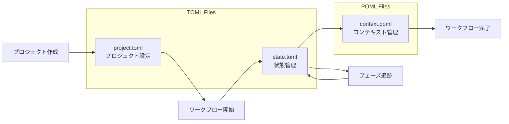

# CC-Deck v2 コアエンジン仕組み

## 概要

CC-Deck v2は、「時間のかかる開発ワークフローを単一コマンドに変える」AI-native開発プラットフォームです。

### 基本構成

CC-Deck v2のコアエンジンは、**5つのファイル**と**1つの統一コマンド**、**5つの専門エージェント**で構成されています：

**ファイル構成**：
- **POML** 3種類：command.poml（コマンド制御）、agent.poml（エージェント定義）、context.poml（コンテキスト管理）
- **TOML** 2種類：project.toml（プロジェクト設定）、state.toml（状態管理）

**実行環境**：
- **統一コマンド**：`/orchestrator [自然言語指示]`
- **専門エージェント**：spec-generator → environment-setup → implementation → code-reviewer → validation

### 設計思想

各ファイルが**単一責務**を持ち、**概念的に明確**な役割分担により、複雑な開発ワークフローを自動化します。Orchestratorが適切なファイルを読み込み、専門エージェントを選択して、段階的にプロジェクトを進行させます。

### 全体フロー



---

## POMLファイルの3つの役割

CC-Deck v2では、POMLファイルは役割に応じて**3種類**に分類されます：



### 1. command.poml - コマンド制御
- **役割**: スラッシュコマンドの解析・処理制御
- **機能**: 自然言語コマンドの解釈、適切なサブエージェント選択
- **例**: `/orchestrator create spec` の解析とルーティング

### 2. agent.poml - エージェント定義
- **役割**: サブエージェントの動作・挙動を制御
- **機能**: AIエージェントの personality、作業方針、出力形式の定義
- **例**: enterprise-agent.poml, rapid-prototyping-agent.poml

### 3. context.poml - コンテキスト管理
- **役割**: フェーズ間のコンテキスト情報の永続化・管理
- **機能**: 作業履歴、意思決定記録、次フェーズへの引き継ぎ情報、技術的制約
- **詳細**: 別ドキュメント「context.poml仕様書」で詳細化予定

## TOMLファイルの2つの役割

CC-Deck v2では、TOMLファイルを**2種類**使用します：



### 1. project.toml - プロジェクト設定
- **役割**: プロジェクト全体の設定・メタデータ管理
- **機能**: 技術スタック、作成日時、アクティブフィーチャー一覧
- **例**: 
```toml
project = "fintech-app"
tech_stack = ["Node.js", "React"]
features = ["user-auth", "payment"]

[metadata]
created_at = "2025-08-23T10:00:00Z"
version = "1.0.0"
description = "Enterprise fintech application"
```

### 2. state.toml - 状態管理
- **役割**: 各フィーチャーの実行状態・進捗管理
- **機能**: フェーズ追跡、承認状況、進捗パーセンテージ
- **例**:
```toml
[current]
phase = "implementation"
feature = "user-auth"

[approvals]
requirements = { approved = true, timestamp = "2025-08-23T09:30:00Z" }
design = { approved = true, timestamp = "2025-08-23T10:00:00Z" }
tasks = { approved = false }

[progress]
requirements = 100
design = 100
implementation = 45
```

## Orchestratorコマンド

Orchestratorは統一されたエントリーポイントとして、自然言語コマンドを解析し適切なサブエージェントを選択します。

### コマンド形式
```bash
/orchestrator [自然言語指示]
```


### 読み込みファイル

#### Orchestrator
- **command.poml** - コマンド解析ルール
- **project.toml** - プロジェクト設定
- **state.toml** - 現在の状態・フェーズ
- **context.poml** - 前回のコンテキスト情報
- **agent.poml** - 選択されたエージェント定義

## サブエージェント

CC-Deck v2では5つの専門サブエージェントが協調してワークフローを実行します。

### 5つの専門エージェント

#### 1. spec-generator - 仕様生成
- **専門領域**: 要件分析、技術設計、タスク分解
- **入力**: ユーザー要求、プロジェクト設定
- **出力**: requirements.md, design.md, tasks.md
- **agent.poml例**: enterprise-agent.poml, rapid-prototyping-agent.poml

#### 2. environment-setup - 開発環境構築
- **専門領域**: プロジェクト初期化、依存関係管理、開発環境設定
- **入力**: 承認済み仕様、技術スタック情報
- **出力**: プロジェクト構造、設定ファイル、開発環境
- **agent.poml例**: docker-based-agent.poml, cloud-native-agent.poml

#### 3. implementation - 実装
- **専門領域**: TDD実装、品質ゲート、統合作業
- **入力**: 承認済み仕様、プロジェクト構造
- **出力**: 実装コード、テストコード、ドキュメント
- **agent.poml例**: tdd-focused-agent.poml, performance-focused-agent.poml

#### 4. code-reviewer - コードレビュー
- **専門領域**: セキュリティ監査、品質分析、承認推奨
- **入力**: 実装されたコード、テストコード
- **出力**: レビュー結果、改善提案、承認可否判定
- **agent.poml例**: security-focused-agent.poml, quality-focused-agent.poml

#### 5. validation - 検証
- **専門領域**: E2Eテスト、パフォーマンス測定、最終承認準備
- **入力**: 実装済みコード、テスト結果
- **出力**: 検証レポート、パフォーマンス分析、リリース準備
- **agent.poml例**: comprehensive-testing-agent.poml, performance-validation-agent.poml

### 読み込みファイル

#### サブエージェント
- **agent.poml** - 挙動制御テンプレート
- **context.poml** - 前フェーズのコンテキスト情報（プロジェクト設定含む）
- **state.toml** - 現在状態

### 更新ファイル

#### サブエージェント完了時
- **state.toml** - 実行結果と進捗を更新
- **context.poml** - 次フェーズ用コンテキスト情報を更新