# CC-Deck v2 概念フロー図

## 全体アーキテクチャ概要（POMLコンテキスト最適化対応）

```mermaid
graph TB
    User[👤 User] --> Orchestrator[🎯 Unified Orchestrator]
    
    subgraph "Core Components"
        Orchestrator --> |自然言語解析| PromptParser[📝 Prompt Parser]
        PromptParser --> |project, command, behavior| Router[🔀 Agent Router]
        Router --> StateManager[📊 State Manager]
        Router --> ContextLoader[📖 Context Loader]
    end
    
    subgraph "Sub-Agents (5 Core + Context)"
        SpecGen[📋 spec-generator]
        CodeReview[🔍 code-reviewer] 
        Implementation[⚙️ implementation]
        Validation[✅ validation]
        ContextOptimizer[🧠 context-optimizer]
    end
    
    subgraph "Configuration System"
        POML[📄 POML Behavior Templates]
        YAML[⚙️ YAML Config Files]
        SpecJSON[📄 spec.json State]
    end
    
    subgraph "POML Context Management"
        ContextPOML[📄 Context POML Files]
        CheckpointManager[🚩 Checkpoint Manager]
        ContextOptimizer --> |最適化| ContextPOML
        CheckpointManager --> |保存/読み込み| ContextPOML
    end
    
    subgraph "Legacy Context (参照用)"
        CLAUDE[📚 CLAUDE.md]
        ProjectFiles[📁 Project Files]
    end
    
    Router --> SpecGen
    Router --> CodeReview
    Router --> Implementation
    Router --> Validation
    Router --> ContextOptimizer
    
    ContextLoader --> |読み込み| ContextPOML
    ContextLoader --> Router
    
    POML --> SpecGen
    POML --> CodeReview
    POML --> Implementation
    POML --> Validation
    ContextPOML --> |コンテキスト提供| SpecGen
    ContextPOML --> |コンテキスト提供| CodeReview
    ContextPOML --> |コンテキスト提供| Implementation
    ContextPOML --> |コンテキスト提供| Validation
    
    StateManager --> SpecJSON
    StateManager --> |フェーズ完了通知| CheckpointManager
    
    SpecGen --> |結果| ContextOptimizer
    CodeReview --> |結果| ContextOptimizer
    Implementation --> |結果| ContextOptimizer
    Validation --> |結果| ContextOptimizer
    
    SpecGen --> StateManager
    CodeReview --> StateManager
    Implementation --> StateManager
    Validation --> StateManager
    
    style ContextOptimizer fill:#e1f5fe
    style ContextPOML fill:#e1f5fe
    style CheckpointManager fill:#e1f5fe
```



## 統一Orchestratorのワークフロー

```mermaid
sequenceDiagram
    participant User
    participant Orchestrator
    participant Parser
    participant Router
    participant SubAgent
    participant StateManager
    participant POML
    
    User->>Orchestrator: /orchestrator create spec for project-x feature-y
    Orchestrator->>Parser: 自然言語プロンプト解析
    Parser->>Parser: extract(project, command, behavior, feature)
    Parser->>Router: {project: "project-x", command: "create spec", feature: "feature-y"}
    
    Router->>StateManager: プロジェクト状態確認
    StateManager->>StateManager: spec.json読み込み
    StateManager->>Router: 現在フェーズ: initial
    
    Router->>POML: behavior template読み込み (該当時)
    POML->>Router: behavior instructions
    
    Router->>SubAgent: Task(spec-generator + behavior)
    SubAgent->>SubAgent: タスク実行
    SubAgent->>StateManager: 成果物 + 状態更新
    StateManager->>StateManager: spec.json更新
    
    StateManager->>Orchestrator: 実行結果 + 次アクション提案
    Orchestrator->>User: 結果報告 + 承認要求
```



## コンテキスト最適化エージェントの処理フロー

```mermaid
flowchart TD
    PhaseComplete[🏁 フェーズ完了通知] --> ContextOptimizer[🧠 context-optimizer]
    
    subgraph "情報収集 (Collection)"
        ContextOptimizer --> CollectResults[📊 実行結果収集]
        ContextOptimizer --> CollectDecisions[🎯 重要決定抽出]
        ContextOptimizer --> CollectConstraints[⚠️ 制約条件抽出]
        ContextOptimizer --> CollectState[📋 現在状態取得]
    end
    
    subgraph "分析・最適化 (Analysis & Optimization)"
        CollectResults --> Analyze[🔍 情報分析]
        CollectDecisions --> Analyze
        CollectConstraints --> Analyze
        CollectState --> Analyze
        
        Analyze --> Prioritize[📊 優先順位付け]
        Prioritize --> Filter[🧹 不要情報除去]
        Filter --> Structure[📋 構造化]
    end
    
    subgraph "POML生成 (POML Generation)"
        Structure --> GeneratePOML[📄 POML形式生成]
        GeneratePOML --> ValidatePOML[✅ POML構文検証]
        ValidatePOML --> OptimizeSize[📏 サイズ最適化]
    end
    
    subgraph "保存・管理 (Storage & Management)"
        OptimizeSize --> SaveContext[💾 コンテキスト保存]
        SaveContext --> UpdateCheckpoint[🚩 チェックポイント更新]
        UpdateCheckpoint --> NotifyReady[📢 準備完了通知]
    end
    
    NotifyReady --> NextPhase[➡️ 次フェーズ開始可能]
    
    style ContextOptimizer fill:#e1f5fe
    style GeneratePOML fill:#fff2cc
    style SaveContext fill:#e8f5e8
```



## サブエージェントの専門領域（コンテキスト最適化対応）

```mermaid
mindmap
  root)CC-Deck v2 Sub-Agents(
    spec-generator
      EARS+記法
      技術設計
      タスク分解
      承認対象: requirements.md, design.md, tasks.md
    code-reviewer
      セキュリティ監査
      品質分析
      コードレビュー
      承認推奨の判定
    implementation
      TDD実装
      品質ゲート
      95%+カバレッジ
      統合作業
    validation
      E2Eテスト
      パフォーマンス測定
      最終承認準備
      ステークホルダー報告
    context-optimizer
      情報収集・分析
      優先順位付け
      POML構造化
      不要情報除去
      チェックポイント管理
      中断・再開対応
```



## コンテキスト管理システム

```mermaid
graph LR
    subgraph "Workflow Phase 1: Specification"
        Spec1[📋 Requirements] 
        Spec2[🏗️ Design]
        Spec3[📝 Tasks]
        SpecState[📊 spec.json]
    end
    
    subgraph "Context Bridge"
        Bridge[🌉 POML Context Bridge]
        ContextState[💾 context-state.json]
    end
    
    subgraph "Workflow Phase 2: Implementation"
        Impl1[⚙️ Code Generation]
        Impl2[🧪 Testing]
        Impl3[📚 Documentation]
        ImplState[📊 spec.json updated]
    end
    
    subgraph "Enhanced CLAUDE.md"
        Dynamic[📝 Dynamic Context Section]
        Decisions[🎯 Key Decisions]
        Constraints[⚠️ Technical Constraints]
    end
    
    SpecState --> Bridge
    Bridge --> ContextState
    Bridge --> Dynamic
    ContextState --> ImplState
    
    Spec1 --> Bridge
    Spec2 --> Bridge
    Spec3 --> Bridge
    
    Bridge --> Impl1
    Bridge --> Impl2
    Bridge --> Impl3
```



## POML vs YAML の役割分離

```mermaid
graph TB
    subgraph "POML Domain (AI-Native)"
        POMLOrch[🎯 orchestrator.poml<br/>統一コマンド処理]
        POMLBehavior[🎭 behavior templates<br/>動的挙動制御]
        POMLContext[🌉 context-bridge.poml<br/>ワークフロー間連携]
        
        POMLOrch --> |自然言語解析| POMLBehavior
        POMLBehavior --> |フェーズ移行| POMLContext
    end
    
    subgraph "YAML Domain (Infrastructure)"
        YAMLConfig[⚙️ project.json/yaml<br/>プロジェクト設定]
        YAMLState[📊 spec.json<br/>状態管理]
        YAMLQuality[✅ quality-gates.yaml<br/>品質要件]
        
        YAMLConfig --> |設定提供| YAMLState
        YAMLState --> |進捗管理| YAMLQuality
    end
    
    subgraph "Integration Points"
        StateSync[🔄 State Synchronization]
        ConfigInject[💉 Config Injection]
    end
    
    POMLOrch --> StateSync
    YAMLState --> StateSync
    YAMLConfig --> ConfigInject
    POMLBehavior --> ConfigInject
    
    style POMLOrch fill:#e1f5fe
    style POMLBehavior fill:#e1f5fe
    style POMLContext fill:#e1f5fe
    style YAMLConfig fill:#f3e5f5
    style YAMLState fill:#f3e5f5
    style YAMLQuality fill:#f3e5f5
```



## 承認メカニズムフロー

```mermaid
stateDiagram-v2
    [*] --> RequirementsGenerated: spec-generator実行
    RequirementsGenerated --> RequirementsPending: requirements.md生成完了
    RequirementsPending --> RequirementsApproved: /orchestrator approve requirements
    RequirementsPending --> RequirementsRejected: 人間が却下
    
    RequirementsApproved --> DesignGenerated: design生成開始
    DesignGenerated --> DesignPending: design.md生成完了
    DesignPending --> DesignApproved: /orchestrator approve design
    DesignPending --> DesignRejected: 人間が却下
    
    DesignApproved --> TasksGenerated: tasks生成開始
    TasksGenerated --> TasksPending: tasks.md生成完了
    TasksPending --> TasksApproved: /orchestrator approve tasks
    TasksPending --> TasksRejected: 人間が却下
    
    TasksApproved --> ImplementationReady: 実装フェーズ開始可能
    ImplementationReady --> QualityGate: implementation実行
    QualityGate --> ValidationReady: 品質ゲート通過
    ValidationReady --> [*]: 最終承認完了
    
    RequirementsRejected --> RequirementsGenerated: 修正して再生成
    DesignRejected --> DesignGenerated: 修正して再生成
    TasksRejected --> TasksGenerated: 修正して再生成
```



## データフロー概要

```mermaid
flowchart TD
    Input[👤 自然言語入力] --> Parse[📝 プロンプト解析]
    Parse --> Context[📚 コンテキスト読み込み]
    
    subgraph "Configuration Loading"
        POML_Load[📄 POML Behavior読み込み]
        State_Load[📊 spec.json状態読み込み]
        Project_Load[⚙️ プロジェクト設定読み込み]
    end
    
    Context --> POML_Load
    Context --> State_Load  
    Context --> Project_Load
    
    POML_Load --> Execute[🎯 Sub-Agent実行]
    State_Load --> Execute
    Project_Load --> Execute
    
    Execute --> Generate[📝 成果物生成]
    Generate --> Validate[✅ 品質検証]
    Validate --> Update[📊 状態更新]
    
    Update --> Approval{🔍 承認必要?}
    Approval -->|Yes| HumanReview[👤 人間承認]
    Approval -->|No| NextAction[➡️ 次アクション]
    
    HumanReview -->|承認| NextAction
    HumanReview -->|却下| Execute
    
    NextAction --> Output[📤 結果出力]
    
    style Input fill:#e8f5e8
    style Output fill:#e8f5e8
    style Execute fill:#fff2cc
    style HumanReview fill:#ffe6e6
```



## コンテキスト最適化エージェントの出力例

### POML Context File Structure
```xml
<!-- context-spec-to-impl.poml -->
<poml>
  <context-metadata>
    <checkpoint>specification-complete</checkpoint>
    <project>fintech-app</project>
    <feature>user-authentication</feature>
    <phase-transition>spec → implementation</phase-transition>
    <timestamp>2025-08-22T10:30:00Z</timestamp>
    <optimization-score>92</optimization-score>
  </context-metadata>
  
  <key-decisions>
    <decision type="architecture" impact="high">
      Microservices architecture with JWT authentication
      Rationale: Scalability and security requirements
    </decision>
    <decision type="technology" impact="medium">
      Node.js + Express + PostgreSQL + Redis
      Rationale: Team expertise and performance requirements
    </decision>
  </key-decisions>
  
  <active-constraints>
    <performance>API response time < 200ms</performance>
    <security>GDPR compliance + MFA support required</security>
    <quality>95%+ test coverage mandatory</quality>
  </active-constraints>
  
  <approval-status>
    <approval type="requirements" status="approved" by="product_owner" at="2025-08-22T09:15:00Z" />
    <approval type="design" status="approved" by="tech_lead" at="2025-08-22T10:00:00Z" />
    <approval type="tasks" status="pending" />
  </approval-status>
  
  <implementation-context>
    <tech-stack>Node.js, Express, PostgreSQL, Redis, Jest</tech-stack>
    <project-structure>services/auth, services/api, shared/models</project-structure>
    <test-strategy>Unit + Integration + E2E with TDD approach</test-strategy>
    <deployment>Docker + Kubernetes + Helm charts</deployment>
  </implementation-context>
  
  <next-actions>
    <primary>Start TDD implementation of authentication service</primary>
    <dependencies>Database schema setup, JWT token configuration</dependencies>
    <quality-gates>Linting, type checking, security scan, 95%+ coverage</quality-gates>
  </next-actions>
  
  <excluded-info>
    <!-- context-optimizerが除外した情報のメタデータ -->
    <excluded>Detailed user stories (moved to tasks.md)</excluded>
    <excluded>Initial brainstorming notes (not relevant for implementation)</excluded>
    <excluded>Alternative architecture options (decision made)</excluded>
  </excluded-info>
</poml>
```

### Context Optimizer Sub-Agent Definition
```markdown
---
name: context-optimizer
description: Analyze phase results and generate optimized POML context for seamless workflow continuation
model: sonnet
tools: [Read, Write, Edit, LS]
---

# Context Optimizer Agent

## Specialized Responsibility
Extract, analyze, and optimize workflow context from completed phases, generating structured POML files that enable perfect workflow continuation after interruptions.

## Core Functions
1. **Information Collection**: Gather all artifacts, decisions, constraints from completed phase
2. **Priority Analysis**: Identify critical information needed for next phase
3. **Context Optimization**: Remove redundant data, optimize for token efficiency
4. **POML Generation**: Structure optimized context in POML format
5. **Checkpoint Management**: Create resumable checkpoints with complete context

## Process
1. Always load current phase results and state
2. Analyze information importance and relevance for next phase
3. Extract key decisions, constraints, and actionable items
4. Generate optimized POML context file
5. Validate POML syntax and completeness
6. Update checkpoint manager with new context file

## Input Requirements
- Phase completion notification
- All artifacts from completed phase (requirements.md, design.md, etc.)
- Current spec.json state
- Previous context POML (if exists)

## Output Specifications
- Optimized POML context file
- Context metadata (optimization score, excluded info summary)
- Checkpoint update confirmation
- Next phase readiness assessment
```

---

**作成日**: 2025-08-22  
**バージョン**: 1.1.0  
**ステータス**: POMLコンテキスト最適化対応完了