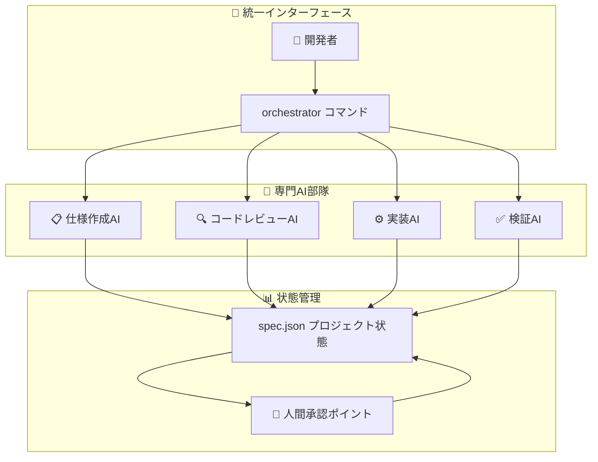
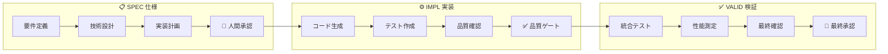
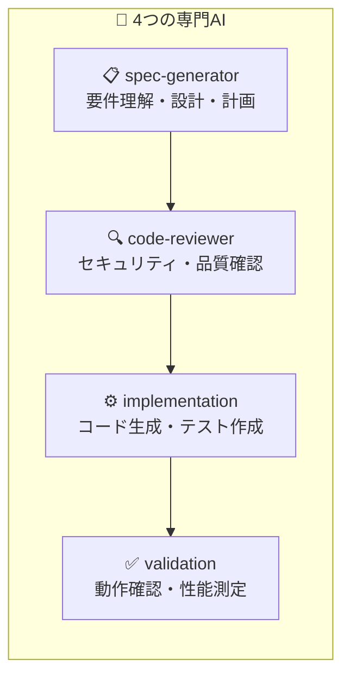
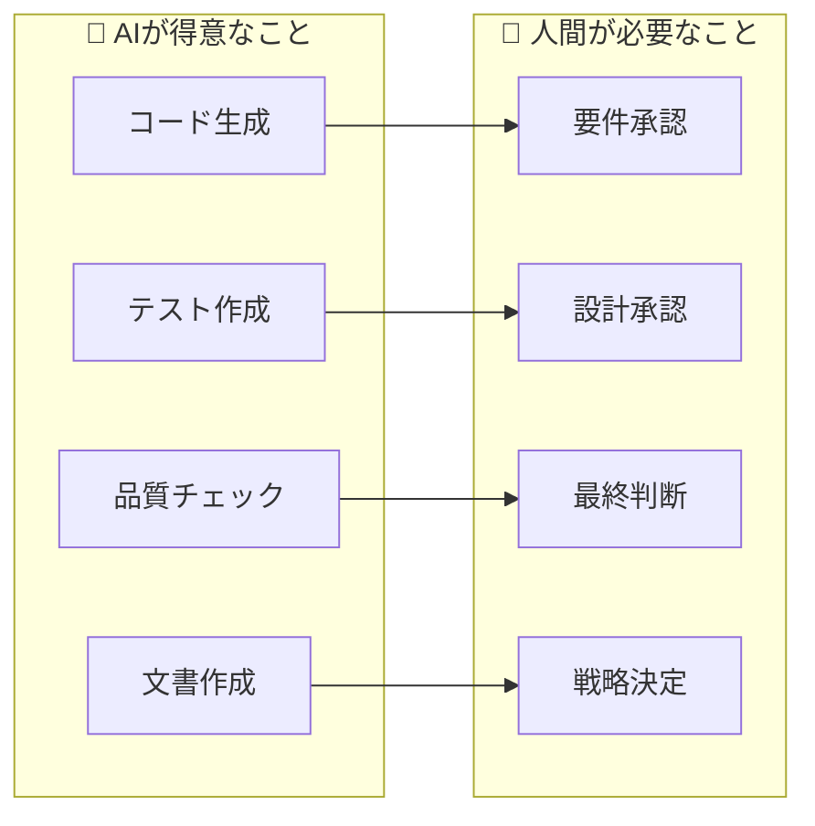
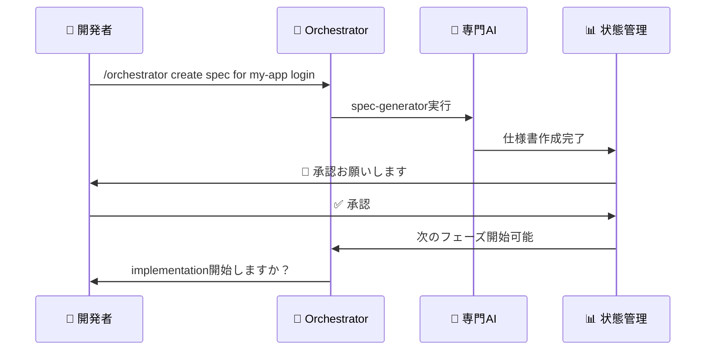

# CC-Deck v2 基本骨格

## 🎯 CC-Deck v2とは？

**「時間のかかるワークフローを単一コマンドに変える」AI-native開発プラットフォーム**

```
従来: 何時間もかけて手動で行う開発ワークフロー
     ↓
CC-Deck v2: 一つのコマンドで自動化されたワークフロー
```

## 🏗️ 基本構造（3つの柱）



## 🚀 基本的な使い方

### シンプルな例
```bash
# 1. 新しい機能の仕様を作成
/orchestrator create specification for my-app user-login

# 2. 仕様を承認（人間）
/orchestrator approve requirements for my-app user-login

# 3. 実装を開始
/orchestrator implement my-app user-login

# 4. テスト・検証
/orchestrator validate my-app user-login
```

## 🎪 3つの主要ワークフロー



## 🧠 4つの専門AI



## 📊 状態管理の仕組み

### spec.json（プロジェクトの頭脳）
```json
{
  "project": "my-app",
  "feature": "user-login", 
  "phase": "implementation",
  "approvals": {
    "requirements": { "approved": true },
    "design": { "approved": true },
    "implementation": { "approved": false }
  },
  "progress": {
    "requirements": 100,
    "design": 100, 
    "implementation": 45
  }
}
```

## 👤 人間の役割



## 🔄 基本フロー



## 💡 CC-Deck v2の価値

### Before（従来）
- ❌ 手動で何時間もかかる作業
- ❌ ステップを忘れやすい
- ❌ 品質にバラつきがある
- ❌ プロジェクト間で一貫性がない

### After（CC-Deck v2）
- ✅ 1つのコマンドで自動化
- ✅ 必要なステップを漏れなく実行
- ✅ 一定の品質を保証
- ✅ すべてのプロジェクトで統一された流れ

## 🎨 設計思想

### シンプルな原則
1. **統一インターフェース**: すべて `/orchestrator` から
2. **専門分業**: 各AIが得意分野に集中
3. **人間中心**: 重要な判断は必ず人間が行う
4. **状態透明性**: いつでも進捗・状況が確認できる
5. **中断・再開**: どこで止めても続きから始められる

---

**CC-Deck v2 = 1つのコマンドで、プロの開発チームと同じワークフローを自動実行**

---

**作成日**: 2025-08-22  
**バージョン**: 1.0.0  
**ステータス**: 基本骨格確定