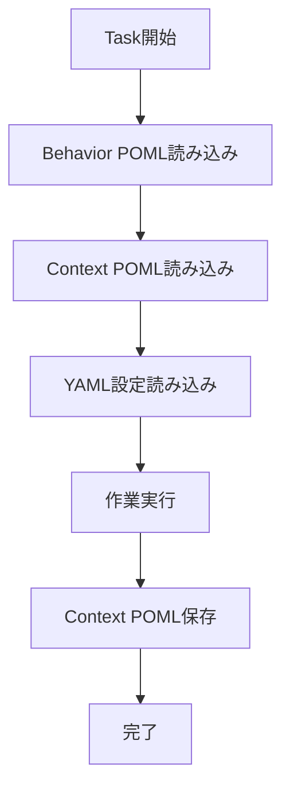
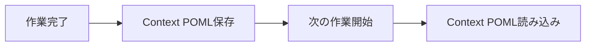
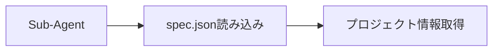

# CC-Deck v2 仕組み解説

## 🎪 Orchestrator（どのエージェントを呼ぶか決める）

```mermaid
graph LR
    Input[/orchestrator create spec] --> Orchestrator{コマンド解析}
    Orchestrator -->|create| SpecAgent[spec-generator]
    Orchestrator -->|review| ReviewAgent[code-reviewer] 
    Orchestrator -->|implement| ImplAgent[implementation]
    Orchestrator -->|validate| ValidAgent[validation]
```

**判定ルール**: コマンドの動詞で決める
- `create spec` → spec-generator
- `review` → code-reviewer
- `implement` → implementation  
- `validate` → validation

## 🤖 Sub-Agent（実際の作業をする）



**何をするか**: 
1. Behavior POML → どんな風に作業するか
2. Context POML → 前回までの状況
3. YAML → プロジェクト設定
4. 作業実行
5. 結果をContext POMLに保存

## 📜 Behavior POML（どんな風に作業するか指示）

```mermaid
graph LR
    Command[/orchestrator with enterprise] --> DetectBehavior[enterprise検出]
    DetectBehavior --> LoadPOML[enterprise.poml読み込み]
    LoadPOML --> ApplyBehavior[Sub-Agentに適用]
```

**例**: enterprise-development.poml
```xml
<poml>
  <role>企業レベルの厳格な開発</role>
  <task>セキュリティ分析も含めた仕様作成</task>
  <output-format>経営陣向けサマリーも含める</output-format>
</poml>
```

**何をするか**: コマンドに「with enterprise」があれば、enterprise.pomlを読み込んでSub-Agentに渡す

## 💾 Context POML（前回の作業内容を覚えておく）



**何をするか**: 作業が終わったら重要な情報をContext POMLファイルに保存。次に作業するときはそれを読み込む。

## ⚙️ YAML Files（プロジェクト設定）



**spec.json例**:
```json
{
  "project": "my-app",
  "phase": "implementation",
  "approvals": {"requirements": {"approved": true}}
}
```

**何をするか**: プロジェクトの現在状態や設定をYAMLファイルに保存。Sub-Agentがそれを読んで作業する。

---

**作成日**: 2025-08-22  
**バージョン**: 1.0.0  
**ステータス**: 仕組み解説完了