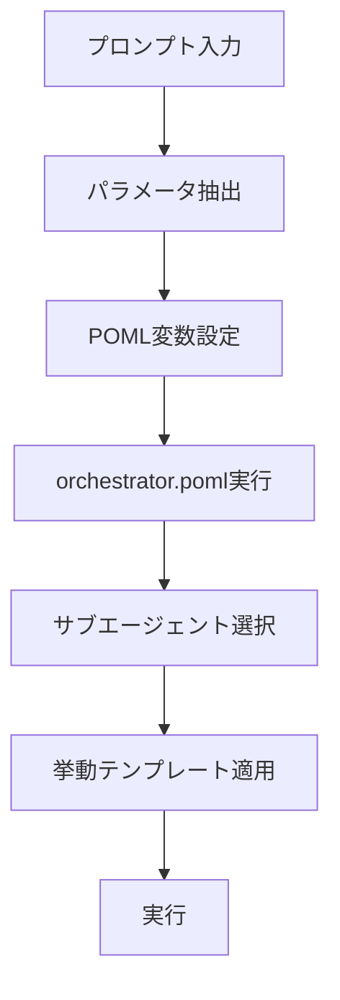

# Orchestrator Interface Specification (MVP)

## 1. 概要

CC-Deck v2のorchestratorは、自然言語プロンプト入力を解析してパラメータを抽出し、適切なサブエージェントに処理を委譲するシステムです。

## 2. 入力インターface

### 2.1 プロンプト形式

```
/orchestrator [自然言語の指示]
```

### 2.2 サポートする指示パターン

#### 基本パターン
```
/orchestrator review src/auth.js
/orchestrator implement user authentication feature
/orchestrator create specification for payment system
```

#### 挙動指定パターン
```
/orchestrator review src/auth.js with strict security analysis
/orchestrator implement user-auth using rapid prototyping approach
/orchestrator review payment module with security focus
```

## 3. パラメータ抽出仕様

### 3.1 抽出対象パラメータ

| パラメータ | 型 | 説明 | 例 |
|-----------|----|----|-----|
| `command` | string | 実行コマンド | "review", "implement", "spec" |
| `target` | string | 対象ファイル/モジュール | "src/auth.js", "user-auth" |
| `behavior` | string | 挙動テンプレート | "strict-security-review", "rapid-prototyping" |
| `project` | string | プロジェクト名 | "fintech-app" |
| `feature` | string | 機能名 | "user-authentication" |

### 3.2 抽出ルール

#### コマンド識別
- **review**: "review", "check", "analyze", "audit"
- **implement**: "implement", "create", "build", "develop"
- **spec**: "specification", "spec", "requirement", "design"

#### 挙動識別
- **strict-security-review**: "security", "strict", "audit"
- **rapid-prototyping**: "rapid", "prototype", "quick", "fast"
- **enterprise-development**: "enterprise", "production", "robust"

#### ターゲット識別
- ファイルパス: `src/`, `components/`, `.js`, `.ts`, `.md`
- モジュール名: `auth`, `payment`, `user-`, `api-`

## 4. 処理フロー

### 4.1 基本フロー



### 4.2 詳細処理

1. **プロンプト解析**
   - 自然言語からキーワード抽出
   - パラメータマッピング
   - 不明な場合のデフォルト値設定

2. **POML変数注入**
   ```xml
   <let name="command" value="review" />
   <let name="target" value="src/auth.js" />
   <let name="behavior" value="strict-security-review" />
   ```

3. **サブエージェント呼び出し**
   - コマンドに基づく適切なエージェント選択
   - 挙動テンプレートの読み込み
   - コンテキスト情報の引き渡し

## 5. 入出力例

### 5.1 基本的なコードレビュー

**入力:**
```
/orchestrator review src/components/AuthForm.tsx
```

**抽出パラメータ:**
```json
{
  "command": "review",
  "target": "src/components/AuthForm.tsx",
  "behavior": null,
  "project": null,
  "feature": null
}
```

**実行:**
- code-reviewerサブエージェント呼び出し
- デフォルト挙動でレビュー実行

### 5.2 セキュリティ重視レビュー

**入力:**
```
/orchestrator review authentication module with strict security analysis
```

**抽出パラメータ:**
```json
{
  "command": "review",
  "target": "authentication module",
  "behavior": "strict-security-review",
  "project": null,
  "feature": null
}
```

**実行:**
- code-reviewerサブエージェント呼び出し
- strict-security-review.poml挙動適用
- セキュリティ重視の詳細分析実行

### 5.3 高速プロトタイピング実装

**入力:**
```
/orchestrator implement user authentication feature using rapid prototyping
```

**抽出パラメータ:**
```json
{
  "command": "implement",
  "target": "user authentication feature",
  "behavior": "rapid-prototyping",
  "project": null,
  "feature": "user-authentication"
}
```

**実行:**
- implementationサブエージェント呼び出し
- rapid-prototyping.poml挙動適用
- 高速プロトタイプ実装実行

## 6. プロジェクトコンテキスト管理

### 6.1 プロジェクト特定の重要性
プロジェクトが特定できれば、以下の情報が自動的に取得可能：

```json
// projects/{project-name}/specs/{feature-name}/spec.json
{
  "phase": "design-generated",
  "approvals": {
    "requirements": { "generated": true, "approved": true },
    "design": { "generated": true, "approved": false },
    "tasks": { "generated": false, "approved": false }
  },
  "progress": {
    "requirements": 100,
    "design": 100,
    "tasks": 0
  }
}
```

### 6.2 プロジェクト特定フロー
```
1. プロンプトからプロジェクト名を抽出試行
2. 抽出失敗時は対話的に確認
3. プロジェクト特定後、spec.jsonから状態を読み込み
4. 現在のフェーズに応じた適切なアクションを提案
```

## 7. エラーハンドリング

### 7.1 プロジェクト不明時の対話
```
入力: /orchestrator implement user authentication
出力: "どのプロジェクトで作業しますか？利用可能なプロジェクト: fintech-app, e-commerce-platform, blog-system"
入力: fintech-app
処理: プロジェクトコンテキストを読み込んで実行
```

### 7.2 フェーズ確認と次のアクション提案
```
入力: /orchestrator continue fintech-app
出力: "fintech-app の user-authentication feature は現在 design-generated フェーズです。
       設計の承認待ちです。次のアクションを選択してください：
       1. 設計をレビューする
       2. 設計を承認して実装に進む
       3. 設計を修正する"
```

### 7.3 承認状況に基づく制約
```
入力: /orchestrator implement fintech-app user-auth
出力: "設計がまだ承認されていません。先に設計を承認する必要があります。
       '/orchestrator approve design for fintech-app user-auth' を実行してください。"
```

## 7. 実装要件

### 7.1 プロンプト解析機能
- 自然言語からのキーワード抽出
- パターンマッチングによるパラメータ識別
- あいまいさ解決のための対話機能

### 7.2 POML変数システム
- 動的変数設定機能
- テンプレート変数置換
- 条件分岐評価

### 7.3 サブエージェント連携
- エージェント選択ロジック
- コンテキスト情報の引き渡し
- 実行結果の統合

## 8. プロジェクトベースのワークフロー管理

### 8.1 プロジェクト特定の必須化
orchestratorは必ずプロジェクトを特定してから処理を実行します。

#### プロジェクト特定フロー
```
1. プロンプトからプロジェクト名を抽出
2. 抽出失敗時は対話的に確認
3. プロジェクトのspec.jsonから現在状態を読み込み
4. フェーズと承認状況に基づいて適切な処理を実行
```

### 8.2 spec.jsonによる状態管理
```json
{
  "project": "fintech-app",
  "feature": "user-authentication",
  "phase": "design-generated",  // 現在のフェーズ
  "approvals": {
    "requirements": {
      "generated": true,
      "approved": true  // 要件承認済み
    },
    "design": {
      "generated": true,
      "approved": false  // 設計承認待ち
    },
    "tasks": {
      "generated": false,
      "approved": false
    }
  },
  "progress": {
    "requirements": 100,
    "design": 100,
    "tasks": 0
  }
}
```

### 8.3 フェーズ駆動のワークフロー

#### 継続コマンド
```bash
User: /orchestrator continue fintech-app
System: 現在のフェーズを確認 → 次の適切なアクションを提案
```

#### フェーズごとの次アクション
| 現在フェーズ | 次のアクション |
|------------|--------------|
| requirements-generated | 要件レビューと承認 |
| requirements-approved | 技術設計生成 |
| design-generated | 設計レビューと承認 |
| design-approved | タスク生成 |
| tasks-generated | タスクレビューと承認 |
| tasks-approved | 実装開始 |
| implementation-in-progress | テスト実行 |
| testing-complete | デプロイ準備 |

### 8.4 承認ゲートの自動チェック

#### 実装前の承認チェック
```bash
User: /orchestrator implement fintech-app user-auth
System: [spec.json確認]
        → design.approved = false
        → "設計承認が必要です。'/orchestrator approve design for fintech-app user-auth'"
```

#### 承認コマンド
```bash
User: /orchestrator approve design for fintech-app user-auth
System: [spec.jsonを更新]
        → design.approved = true
        → phase = "design-approved"
        → "設計が承認されました。実装を開始できます。"
```

### 8.5 プロジェクト一覧と状態確認

#### 利用可能プロジェクトの表示
```bash
User: /orchestrator list projects
System: 
利用可能なプロジェクト:
1. fintech-app (phase: design-approved) - 実装準備完了
2. e-commerce-platform (phase: requirements-generated) - 要件承認待ち
3. blog-system (phase: implementation-in-progress) - 実装中
```

#### プロジェクト状態の詳細確認
```bash
User: /orchestrator status fintech-app
System:
プロジェクト: fintech-app
フィーチャー: user-authentication
現在フェーズ: design-approved
承認状況:
  ✅ 要件: 承認済み (100%)
  ✅ 設計: 承認済み (100%)
  ⏸️ タスク: 未生成 (0%)
次のアクション: タスク生成 (/orchestrator generate tasks for fintech-app user-auth)
```

### 8.6 コンテキスト継承

プロジェクトが特定されると、以下が自動的に継承されます：

- **過去の決定事項**: 要件や設計での決定
- **技術選択**: 使用するフレームワークやライブラリ
- **制約条件**: セキュリティ要件やパフォーマンス基準
- **ステアリング**: プロジェクト固有のコーディング規約

### 8.7 エラー防止機能

#### フェーズスキップ防止
```bash
User: /orchestrator implement before design approval
System: "エラー: 設計承認前に実装はできません。正しいワークフロー順序に従ってください。"
```

#### 重複作業防止
```bash
User: /orchestrator generate requirements for fintech-app user-auth
System: "要件は既に生成・承認済みです (100%)。次は設計フェーズです。"
```

## 9. 将来拡張

### 8.1 対話型パラメータ確認
```
User: /orchestrator review auth
System: "どのファイルをレビューしますか？ src/auth.js, src/auth/, src/components/Auth.tsx"
User: "src/auth.js"
```

### 8.2 学習機能
- ユーザーの指示パターン学習
- 個人化されたパラメータ抽出
- コンテキスト履歴の活用

### 8.3 複合コマンド
```
/orchestrator "review auth module then implement improvements with security focus"
```

この仕様に基づいて、プロンプト解析とパラメータ設定機能を実装していきます。