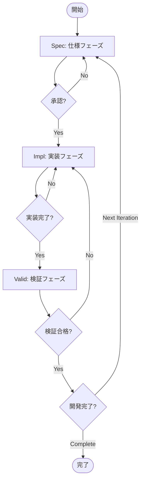

# CC-Deck v2 ワークフロー仕様書

## 概要

CC-Deck v2は、仕様、実装、評価に特化した次世代AI駆動型開発プラットフォームです。**Spec（仕様）→ Impl（実装）→ Valid（検証）**の3つのフェーズを繰り返すことで、高品質なソフトウェアを効率的に開発するためのワークフローシステムを提供します。

### CC-Deck v2の基本理念

CC-Deck v2は従来のcc-deckとは異なり、**仕様、実装、評価に特化した開発プラットフォーム**として設計されています。新規プロジェクトの作成から継続的な開発まで、以下の基本原則に基づいてAI駆動の開発基盤を提供します：

#### 核心的価値提案
- **統一オーケストレーターによる自然言語インターフェース**: `/orchestrator`による直感的なワークフロー実行
- **プロジェクトコンテキスト駆動**: spec.jsonによる状態管理とフェーズベース制御
- **サブエージェントによる専門的作業**: ドメイン特化したClaude Code Sub-agentが高度な作業を自動化
- **POML挙動制御**: 既存behavior.pomlテンプレートによる動的な実行挙動変更
- **品質重視のドキュメント生成**: AI支援による高品質な仕様書、設計書、技術文書の作成
- **テスト駆動開発の徹底**: 95%以上のカバレッジを目標とした堅牢なコード実装
- **包括的テスト環境**: ユニット、統合、E2E、パフォーマンステストの完全自動化

#### プラットフォームの特徴
- **AI-ネイティブ設計**: Claude Code の能力を最大限活用した開発ワークフロー
- **品質ゲート自動化**: 各段階での品質基準自動チェックと承認フロー
- **コンテキスト永続化**: プロジェクト知識とノウハウの蓄積・継承
- **拡張可能アーキテクチャ**: プロジェクト特性に応じたカスタマイズ対応

### 目標
- **「時間のかかるワークフローを単一コマンドに」**
- AIとヒューマンの最適な協調による効率化
- 継続的な品質向上とイテレーション
- 明確な責任分離と自動化による信頼性確保

### 基本サイクル
```
要求 → [Spec] → [Impl] → [Valid] → 完成品
      ↗️                           ↩️
    改善要求                   次のイテレーション
```

## ワークフローアーキテクチャ

### フロー図



### フェーズ遷移と状態管理

各フェーズは明確な遷移条件を持ち、品質ゲートによって次のステップへの進行が制御されます。

```yaml
workflow_states:
  spec:
    phases:
      - init
      - requirements
      - design
      - tasks
      - approved
    transitions:
      - from: init
        to: requirements
        type: automatic
      - from: requirements
        to: design
        type: approval_required
      - from: design
        to: tasks
        type: approval_required
      - from: tasks
        to: approved
        type: approval_required
  
  impl:
    phases:
      - setup
      - tdd_cycles
      - integration
      - documentation
    transitions:
      - from: setup
        to: tdd_cycles
        type: automatic
      - from: tdd_cycles
        to: integration
        type: quality_gate
        conditions:
          coverage: ">= 95"
          lint_errors: "== 0"
          type_errors: "== 0"
      - from: integration
        to: documentation
        type: automatic
  
  valid:
    phases:
      - unit_tests
      - integration_tests
      - e2e_tests
      - performance
    transitions:
      - from: unit_tests
        to: integration_tests
        type: coverage_gate
        condition:
          coverage: ">= 95"
      - from: integration_tests
        to: e2e_tests
        type: automatic
      - from: e2e_tests
        to: performance
        type: automatic
```

## Specフェーズ（仕様策定）

### 目的
**ユーザーの要求を明確で実装可能な仕様に変換する**

曖昧な要求を構造化された実装可能な仕様書に変換し、開発チーム全体で共通理解を築きます。

### 成功基準
- 要求が明確で検証可能
- 設計が実現可能で拡張性がある
- タスクが適切な粒度で分解されている
- 全てのステークホルダーが仕様に合意

### サブフェーズ詳細

#### 1. 仕様生成開始
- **コマンド**: `/orchestrator create specification for [project] [feature]`
- **処理**: プロジェクトコンテキスト確認、ディレクトリ構造作成、初期ファイル生成
- **出力**: `specs/{feature-name}/`ディレクトリ構造
- **所要時間**: 1-2分
- **実行者**: orchestrator → spec-generator sub-agent

#### 2. 要求分析
- **コマンド**: `/orchestrator generate requirements for [project] [feature]`
- **処理**: EARS+記法での要求定義、コンテキスト分析、MCP研究統合
- **出力**: `requirements.md`（構造化された要求仕様）
- **承認**: 必須（ヒューマンレビュー）
- **所要時間**: 15-30分
- **実行者**: orchestrator → spec-generator sub-agent

**EARS+記法例:**
```markdown
WHEN ユーザーがログインボタンをクリックした時
THE SYSTEM SHALL 認証情報を検証し
AND 成功時はダッシュボードにリダイレクトする
```

#### 3. 技術設計
- **コマンド**: `/orchestrator design technical architecture for [project] [feature]`
- **処理**: アーキテクチャ設計、技術選定、インターフェース定義
- **出力**: `design.md`（技術設計書）
- **承認**: 必須（ヒューマンレビュー）
- **所要時間**: 20-45分
- **実行者**: orchestrator → spec-generator sub-agent

**設計書に含まれる要素:**
- システムアーキテクチャ図
- 技術スタック選定理由
- データベース設計
- API仕様定義
- セキュリティ考慮事項

#### 4. タスク分解
- **コマンド**: `/orchestrator generate implementation tasks for [project] [feature]`
- **処理**: 実装タスクの詳細分解、TDDシナリオ作成
- **出力**: `tasks.md`（実装タスクリスト）
- **承認**: 必須（ヒューマンレビュー）
- **所要時間**: 10-20分
- **実行者**: orchestrator → spec-generator sub-agent

**タスク例:**
```markdown
- [ ] ユーザー認証APIエンドポイント作成
  - テストケース: 正常ログイン、不正な認証情報、アカウントロック
  - 推定工数: 4時間
  - 依存関係: データベース設計完了
```

### 品質チェックポイント

#### 要求仕様（requirements.md）
- [ ] すべての要求がEARS+記法で記述されている
- [ ] 受け入れ基準が明確に定義されている
- [ ] 非機能要求（パフォーマンス、セキュリティ）が含まれている
- [ ] 既存システムとの整合性が確認されている

#### 技術設計（design.md）
- [ ] アーキテクチャ図が含まれている
- [ ] 技術選定に明確な根拠がある
- [ ] データフロー図が作成されている
- [ ] セキュリティリスクが評価されている

#### タスク分解（tasks.md）
- [ ] タスクが1-8時間の粒度で分解されている
- [ ] 各タスクにテストシナリオが定義されている
- [ ] 依存関係が明確に示されている
- [ ] 推定工数が記載されている

## Implフェーズ（実装）

### 目的
**承認済み仕様に基づく高品質な実装の作成**

仕様書に定義された機能をTDD（テスト駆動開発）により実装し、品質基準を満たすコードを作成します。

### 成功基準
- 全てのテストがパス（95%以上のカバレッジ）
- Lintエラー0、型エラー0
- セキュリティ脆弱性0
- パフォーマンス基準をクリア

### サブフェーズ詳細

#### 1. プロジェクトセットアップ
- **コマンド**: `/orchestrator implement [project] [feature]`（初期化フェーズ）
- **処理**: プロジェクト構造生成、依存関係設定
- **出力**: 初期プロジェクト構造
- **所要時間**: 5-10分
- **実行者**: orchestrator → implementation sub-agent

**生成される構造例:**
```
project/
├── src/
├── tests/
├── docs/
├── package.json
└── README.md
```

#### 2. TDD実装サイクル
- **コマンド**: `/orchestrator implement [project] [feature] using test-driven development`
- **処理**: Red→Green→Refactorサイクルの反復
- **出力**: テスト駆動による実装コード
- **所要時間**: タスク数に依存（通常1-4時間）
- **実行者**: orchestrator → implementation sub-agent (TDD behavior適用)

**TDDサイクル:**
1. **Red**: 失敗するテストを書く
2. **Green**: テストをパスする最小限のコードを書く
3. **Refactor**: コードを改善する

**品質ゲート**: 
- テストカバレッジ95%以上
- Lintエラー0
- 型チェック合格

#### 3. 統合
- **コマンド**: `/orchestrator integrate components for [project] [feature]`
- **処理**: コンポーネント統合、API接続
- **出力**: 統合済みアプリケーション
- **所要時間**: 15-30分
- **実行者**: orchestrator → implementation sub-agent

**統合作業内容:**
- コンポーネント間の依存関係解決
- API エンドポイントの設定
- データベース接続設定
- 環境変数の設定

#### 4. ドキュメント生成
- **コマンド**: `/orchestrator generate documentation for [project] [feature]`
- **処理**: APIドキュメント、使用ガイド生成
- **出力**: 完全なドキュメント
- **所要時間**: 10-15分
- **実行者**: orchestrator → implementation sub-agent

**生成されるドキュメント:**
- API仕様書（OpenAPI/Swagger）
- 使用方法ガイド
- 設定手順書
- トラブルシューティングガイド

### 品質ゲート

各サブフェーズで以下の基準をクリアする必要があります：

#### コード品質
- **テストカバレッジ**: 95%以上
- **Lintエラー**: 0個
- **型エラー**: 0個
- **複雑度**: 10以下（Cyclomatic Complexity）

#### セキュリティ
- **脆弱性スキャン**: Critical/High 0個
- **依存関係チェック**: 既知の脆弱性0個
- **シークレット検出**: 検出された秘密情報0個

#### パフォーマンス
- **レスポンス時間**: 200ms以下（95パーセンタイル）
- **メモリ使用量**: 512MB以下
- **CPU使用率**: 平均70%以下

#### アクセシビリティ（Webアプリの場合）
- **WCAG 2.1 AA準拠**: 100%
- **Lighthouse Score**: 90点以上

## Validフェーズ（検証）

### 目的
**実装の品質と仕様適合性の総合的な検証**

実装されたシステムが仕様を満たし、本番環境で安定動作することを多層的なテストで確認します。

### 成功基準
- 全てのテストスイートがパス
- パフォーマンス基準をクリア
- セキュリティ要件を満たす
- ユーザビリティが確保されている

### サブフェーズ詳細

#### 1. ユニットテスト検証
- **コマンド**: `/orchestrator test [project] [feature] focusing on unit tests`
- **処理**: 全ユニットテストの実行と検証
- **出力**: テストレポート
- **所要時間**: 2-5分
- **実行者**: orchestrator → validation sub-agent

**合格基準**: 
- 全テスト合格（成功率100%）
- カバレッジ95%以上
- テスト実行時間5分以内

#### 2. 統合テスト実行
- **コマンド**: `/orchestrator test [project] [feature] with integration testing`
- **処理**: APIエンドポイント、データフロー検証
- **出力**: 統合テストレポート
- **所要時間**: 5-10分
- **実行者**: orchestrator → validation sub-agent

**合格基準**: 
- 全APIエンドポイント正常動作
- データ整合性確認
- 外部サービス連携正常

#### 3. E2Eテスト実施
- **コマンド**: `/orchestrator test [project] [feature] with end-to-end testing`
- **処理**: ユーザージャーニーの自動検証
- **出力**: E2Eテストレポート
- **所要時間**: 10-20分
- **実行者**: orchestrator → validation sub-agent

**合格基準**: 
- クリティカルパス100%合格
- 主要ユーザーフロー正常動作
- ブラウザ互換性確認

#### 4. パフォーマンス検証
- **コマンド**: `/orchestrator test [project] [feature] with performance validation`
- **処理**: 負荷テスト、レスポンス測定
- **出力**: パフォーマンスレポート
- **所要時間**: 15-30分
- **実行者**: orchestrator → validation sub-agent

**合格基準**: 
- レスポンス時間SLA達成
- 同時接続数要件クリア
- リソース使用量基準内

### 検証失敗時の処理
- 失敗箇所の特定と原因分析
- Implフェーズへの自動フィードバック
- 修正タスクの自動生成

## イテレーション制御

### 反復条件
1. **機能追加**: 新規要求がある場合、Specフェーズから再開
2. **不具合修正**: Validフェーズで問題発見時、Implフェーズへ戻る
3. **改善**: パフォーマンスや品質改善のため、任意のフェーズから再開

### イテレーション管理
```yaml
iteration:
  number: 1
  type: feature  # feature | bugfix | improvement
  start_phase: spec  # spec | impl | valid
  context_inheritance:
    previous_decisions: true
    technical_constraints: true
    quality_metrics: true
```

## 状態管理とコンテキスト永続化

### ワークフロー状態ファイル
```
projects/{project-name}/
├── .workflow/
│   ├── state.yaml                    # 現在のワークフロー状態
│   ├── iteration-history.jsonl       # イテレーション履歴
│   └── context/
│       ├── decisions.yaml            # 重要な決定事項
│       ├── constraints.yaml          # 技術的制約
│       ├── metrics.yaml              # 品質メトリクス
│       ├── spec-context.poml         # Specフェーズコンテキスト
│       ├── impl-context.poml         # Implフェーズコンテキスト
│       ├── valid-context.poml        # Validフェーズコンテキスト
│       └── bridge/
│           ├── spec-to-impl.poml     # Spec→Implコンテキスト変換
│           ├── impl-to-valid.poml    # Impl→Validコンテキスト変換
│           └── valid-to-spec.poml    # Valid→Specコンテキスト変換
```

### POMLによるプロンプト構造化

#### POMLの役割
POMLは**個別エージェントのプロンプト定義**に使用し、プロンプトの品質と保守性を向上させます。エージェント間の調整はClaude Code Sub-Agent仕様で実装します。

#### 1. プロンプト構造化
各エージェントのプロンプトをPOML形式で構造化し、明確で保守しやすい指示を作成：

```xml
<!-- spec-context.poml -->
<poml>
  <role>You are a specification context manager for the current project feature</role>
  
  <task>
    Maintain and transfer specification context including requirements, design decisions, and constraints.
    Ensure all context is preserved and accessible for implementation phase.
  </task>
  
  <document src="specs/requirements.md" />
  <document src="specs/design.md" />
  <document src="context/constraints.yaml" />
  
  <output-format>
    Structure: {
      "requirements": {
        "functional": [...],
        "non_functional": [...],
        "acceptance_criteria": [...]
      },
      "design_decisions": {
        "architecture": "...",
        "tech_stack": [...],
        "patterns": [...]
      },
      "constraints": {
        "technical": [...],
        "business": [...],
        "timeline": "..."
      }
    }
  </output-format>
</poml>
```

#### 2. エージェント間連携
エージェント間の調整はClaude Code Sub-Agent仕様を使用し、POMLは各エージェントの個別プロンプトに集中：

```xml
<!-- spec-to-impl.poml -->
<poml>
  <role>You are a context bridge agent transforming specification context into implementation-ready context</role>
  
  <task>
    Transform the approved specification context into actionable implementation context.
    Map requirements to user stories, design to project structure, and constraints to development guidelines.
    Enrich with coding standards and testing frameworks.
  </task>
  
  <document src="context/spec-context.json" />
  <document src="steering/coding-standards.md" />
  <document src="steering/architecture.md" />
  
  <example>
    Input: {
      "requirements": {"functional": ["User login", "Data validation"]},
      "design": {"architecture": "MVC", "tech_stack": ["React", "Node.js"]}
    }
    Output: {
      "user_stories": ["As a user, I want to login securely"],
      "test_scenarios": ["Test successful login", "Test invalid credentials"],
      "project_structure": ["src/controllers/", "src/models/", "src/views/"],
      "dependencies": ["react@18", "express@4"]
    }
  </example>
  
  <output-format>
    Provide JSON with mapped implementation context:
    - Map requirements to user_stories and test_scenarios
    - Map design to project_structure and dependencies
    - Filter constraints to implementation-relevant items
    - Add coding_standards and testing_framework from project steering
  </output-format>
</poml>
```

#### 3. フィードバック分析
イテレーション間の学習を構造化されたプロンプトで管理：

```xml
<!-- valid-to-spec.poml (next iteration) -->
<poml>
  <role>You are an iteration feedback analyzer responsible for transferring validation insights to the next specification cycle</role>
  
  <task>
    Analyze validation results and provide actionable feedback for the next iteration.
    Focus on successful patterns, identify anti-patterns to avoid, and suggest concrete improvements.
    Ensure learning from current iteration informs better specifications.
  </task>
  
  <document src="context/valid-context.json" />
  <document src="context/metrics.yaml" />
  <document src="iteration-history.jsonl" />
  
  <example>
    Input: {
      "test_results": {"coverage": "98%", "performance": "slow"},
      "user_feedback": "UI responsive but data loading slow",
      "technical_debt": "Database queries not optimized"
    }
    Output: {
      "learned_patterns": ["High test coverage achieved with TDD"],
      "anti_patterns": ["Avoid N+1 database queries"],
      "recommendations": ["Add database indexing requirements", "Specify performance criteria"]
    }
  </example>
  
  <output-format>
    Provide structured feedback for the next iteration:
    {
      "learned_patterns": ["Successful approaches to replicate"],
      "anti_patterns": ["Approaches that failed or caused issues"],
      "performance_insights": ["Key performance learnings"],
      "quality_metrics": {"coverage": "X%", "defect_rate": "X"},
      "recommendations": ["Specific improvements for next spec"],
      "risk_mitigation": ["Identified risks and prevention strategies"]
    }
  </output-format>
</poml>
```

### エージェント調整戦略

#### Claude Code Sub-Agent仕様による調整
1. **メインオーケストレーター**: `Task`ツールでサブエージェント呼び出し
2. **状態管理**: YAML形式でワークフロー状態を永続化
3. **コンテキスト受け渡し**: ファイルベースのコンテキスト共有
4. **品質ゲート**: 各フェーズでの品質基準チェック

#### POMLとSub-Agentの使い分け
- **POML**: 個別エージェントのプロンプト品質向上
- **Sub-Agent**: エージェント間のワークフロー制御
- **YAML**: 設定と状態管理
- **ファイルシステム**: コンテキスト永続化

### 状態永続化メカニズム
```yaml
workflow_context:
  current_phase: impl
  current_subphase: tdd_cycles
  completed_tasks:
    - task-1
    - task-2
  pending_tasks:
    - task-3
    - task-4
  quality_metrics:
    coverage: 96.5
    lint_errors: 0
    type_errors: 0
  decisions:
    - phase: spec
      type: architecture
      decision: "Use Next.js App Router"
      rationale: "Better performance and DX"
```

## ワークフロー定義

### マスターオーケストレーター
```yaml
name: cc-deck-master
context:
  project: "${project_name}"
  feature: "${feature_name}"
  iteration: "${iteration_number}"

phases:
  - name: spec
    condition: "${phase == 'spec'}"
    agent: spec-generator
    approval:
      required: true
      type: human
    on_complete:
      next: impl
  
  - name: impl
    condition: "${phase == 'impl'}"
    agent: implementation
    quality_gate:
      coverage:
        minimum: 95
      lint_errors:
        maximum: 0
      type_errors:
        maximum: 0
    on_complete:
      next: valid
  
  - name: valid
    condition: "${phase == 'valid'}"
    agent: validation
    on_success:
      next: complete
    on_failure:
      next: impl

iteration_control:
  continue:
    condition: "${has_new_requirements}"
    reset_to: spec
    preserve_context: true
```

### エージェント定義（POML準拠）

エージェントへのプロンプト指示は**Microsoft POML仕様に準拠**した形式で記述し、Claude Codeが直接理解・実行できる形式とします：

#### POML準拠エージェント
- **spec-generator.poml**: 仕様生成エージェント
- **implementation.poml**: TDD実装エージェント  
- **validation.poml**: 検証エージェント
- **context-bridge.poml**: コンテキスト管理エージェント

#### 標準POML構造
```xml
<poml>
  <role>エージェントの役割とペルソナ</role>
  <task>具体的なタスクと要件</task>
  
  <!-- 外部データ参照 -->
  <document src="specs/requirements.md" />
  <document src="context/constraints.yaml" />
  
  <!-- 実例による指導 -->
  <example>
    Input: ユーザー認証機能の要求
    Output: EARS+記法による構造化要求仕様
  </example>
  
  <output-format>
    構造化された仕様ドキュメント（Markdown形式）
    - 明確な受け入れ基準
    - テスト可能な要求定義
    - 実装ガイドライン
  </output-format>
</poml>
```

#### POMLアプローチの利点
- **プロンプト品質**: 構造化された明確な指示
- **保守性**: モジュラーで再利用可能なプロンプト
- **一貫性**: 標準化されたフォーマット
- **データ統合**: 外部ファイルの自然な参照
- **Claude Code互換**: 直接実行可能な形式

#### 実装における制約
- POMLにはサブエージェント機能はない
- エージェント調整はClaude Code仕様で実装
- 複雑な変数展開は避け、シンプルな構造を維持
- ファイル参照は相対パスを使用

## 承認メカニズム

### spec.json承認状況管理
```json
{
  "approvals": {
    "requirements": {
      "generated": true,
      "approved": false  // 人間承認待ち
    },
    "design": {
      "generated": true,
      "approved": false  // 人間承認待ち
    },
    "tasks": {
      "generated": false,
      "approved": false
    }
  }
}
```

### 人間承認必須の成果物

#### Specificationフェーズ
- **requirements.md**: EARS+要件定義 → `/orchestrator approve requirements for [project] [feature]`
- **design.md**: 技術設計書 → `/orchestrator approve design for [project] [feature]`
- **tasks.md**: 実装タスク分解 → `/orchestrator approve tasks for [project] [feature]`

#### Implementationフェーズ
- **品質ゲート通過**: 95%+テストカバレッジ、lint準拠、型安全性確認
- **セキュリティ審査**: 脆弱性スキャン結果承認
- **アーキテクチャ準拠**: 承認済み設計との整合性確認

#### Validationフェーズ
- **テスト結果承認**: 全テストスイート合格確認
- **パフォーマンス承認**: 基準値クリア確認
- **最終承認**: ステークホルダーサインオフ → `/orchestrator approve implementation for [project] [feature]`

### 自動承認条件
- 軽微な変更（typo修正、ドキュメント更新）
- 95%以上のテストカバレッジを維持する変更
- セキュリティリスクがない変更

### 承認ゲートの実行制約
- 承認されていない仕様では実装フェーズに進行不可
- 承認されていない設計では実装詳細作業に進行不可
- 品質ゲートを通過していない実装では検証フェーズに進行不可

## 成功指標

### 効率性メトリクス
- **サイクル時間**: Spec開始から Valid完了まで
- **イテレーション回数**: 品質達成までの反復回数
- **自動化率**: ヒューマン介入なしで完了したタスクの割合

### 品質メトリクス
- **欠陥密度**: 実装1000行あたりのバグ数
- **テストカバレッジ**: 全フェーズの平均カバレッジ
- **技術的負債**: 継続的な測定とトラッキング

## エラーハンドリング

### フェーズ失敗時の対応
1. **自動リトライ**: 一時的エラーの場合、3回まで自動再試行
2. **ロールバック**: 重大エラー時は前の安定状態へ
3. **エスカレーション**: 解決不能な問題はヒューマンへ

### リカバリーメカニズム
- チェックポイント自動保存（各サブフェーズ完了時）
- 部分的な成功の保持（完了したタスクは保存）
- コンテキスト完全復元（中断からの再開可能）

## 拡張ポイント

### カスタムフェーズの追加
- プラグインアーキテクチャによる新フェーズ追加
- 既存フェーズのカスタマイズ
- 業界固有のワークフロー対応

### 外部ツール統合
- CI/CDパイプライン連携
- プロジェクト管理ツール統合
- モニタリング・アラート連携

## まとめ

CC-Deck v2のワークフローは、**Spec→Impl→Valid**の循環により、高品質なソフトウェアを効率的に開発します。各フェーズは明確な責任範囲を持ち、AIとヒューマンの最適な協調により、**「時間のかかるワークフローを単一コマンドに」**という目標を実現します。

### 主要な特徴
- **明確なフェーズ分離**: 責任範囲が明確で理解しやすい
- **品質ゲート**: 各段階で品質が保証される
- **イテレーティブ**: 継続的な改善と学習
- **AI・ヒューマン協調**: 最適な役割分担
- **拡張可能**: プロジェクトに応じてカスタマイズ可能

---

**CC-Deck v2で、あなたの開発ワークフローを次のレベルへ！**